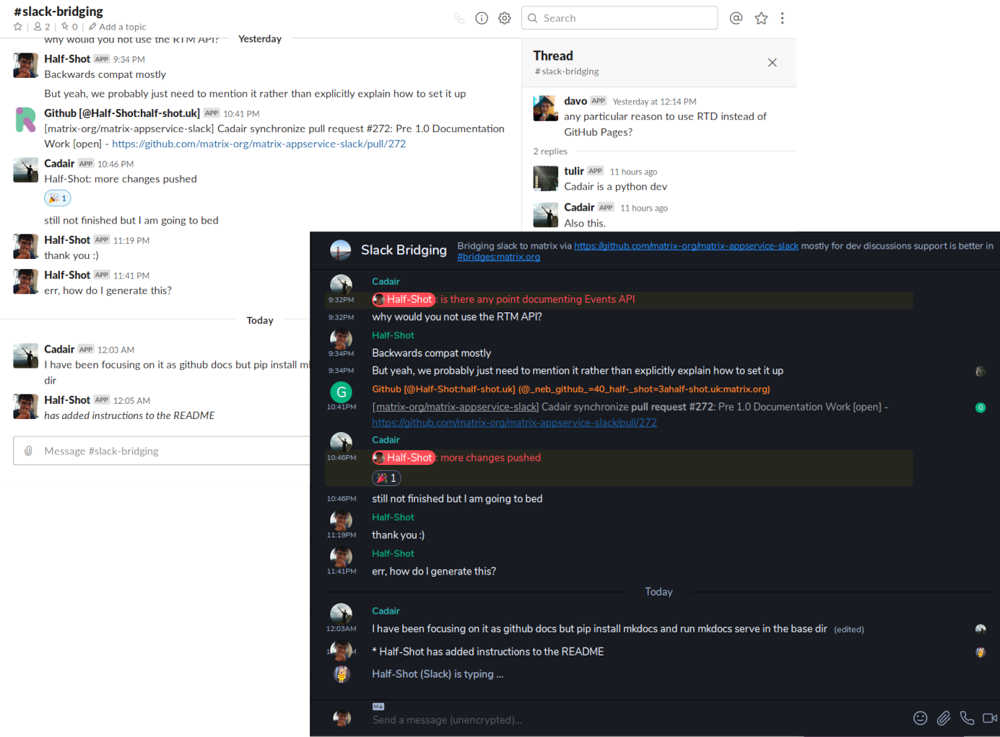

# matrix-appservice-slack

[](https://hub.docker.com/r/matrixdotorg/matrix-appservice-slack)
[](https://matrix.to/#/#slack:half-shot.uk)
[](https://buildkite.com/matrix-dot-org/matrix-appservice-slack)

A bridge that connects [Matrix](https://matrix.org) and [Slack](https://slack.com). The bridge
is considered **stable** and mature for use in production environments.



## Requirements

Hosting this bridge requires you to have a Matrix homeserver. In order to connect a Slack Workspace to your bridge, you will need permission to add bots to it. You will also need Node.JS 10+ or Docker on your system.

## Setting up

See [the docs](docs/getting_started.md) for instructions on how to set up the bridge.

## Helping out

This bridge is a community project and welcomes issues and PRs from anyone who has
the time to spare. If you want to work on the bridge, please see
[CONTRIBUTING.md](./CONTRIBUTING.md). Please come visit us in the [support room](https://matrix.to/#/#matrix_appservice_slack:cadair.com/) if you have any questions.


## Building the documentation

You can build a rendered version of the help documentation by using `mkdocs`.

This requires you to have `python3` and `pip` installed.

```sh
# For Debian-based platforms
$ apt install python3 python3-pip
$ pip3 install mkdocs
mkdocs serve
```
